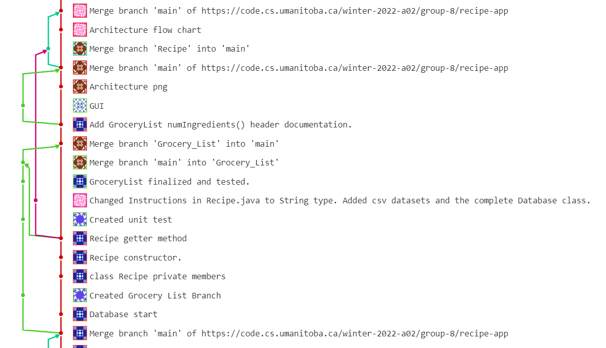

# Branching Strategy

We divided the work and assigned each member a task to complete for Iteration 1. We have a main branch to keep the most recent working branch, and everyone working on their task will have a separate branch. When they're done with their branch, they will push it and create a merge request to the main branch.

---

## Branching Strategy screenshot

